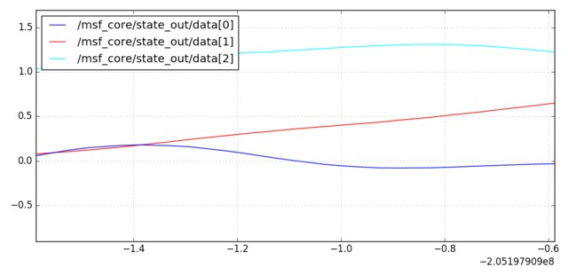

# sensor_fusion_cg

* [ethzasl_sensor_fusion](http://wiki.ros.org/ethzasl_sensor_fusion): Time delay compensated single and multi sensor fusion framework based on an EKF
* [ethzasl_sensor_fusion Tutorials](http://wiki.ros.org/ethzasl_sensor_fusion/Tutorials)
* [robot_localization wiki](http://docs.ros.org/melodic/api/robot_localization/html/)

-----

<div align=center>
  
</div>

# Install & Build

* install dependencies
  ```sh
  wstool init src/ src/dependencies.rosinstall
  ```

* build
  ```sh
  catkin build
  ```

# Usage

## the MSF Viconpos Sensor Example

1. start msf_updates
   ```sh
   roslaunch msf_updates viconpos_sensor.launch
   ```
2. play back dataset
   ```sh
   rosbag play dataset.bag --pause -s 25
   ```
3. plot result data
   <div align=center>
     
   </div>

# Dataset

* [dataset.bag (for test)](http://wiki.ros.org/ethzasl_sensor_fusion/Tutorials/Introductory%20Tutorial%20for%20Multi-Sensor%20Fusion%20Framework?action=AttachFile&do=view&target=dataset.bag)
